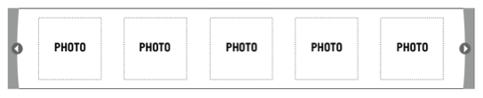

* The wireframe below demonstrates all the necessary UI elements. We have provided both the thumbnail and arrow images in the ZIP package.
* Must include at least 10 images, with 5 viewable at any given moment. •	Clicking the left and right arrows should shift the images incrementally. No animation is necessary.
* When the user has reached the start or end point, the photos should loop as a carousel would.
* Please code the page according to industry best practices and organize the assets as you would if delivering it to a client to integrate.
* Do not use any third-party JavaScript packages, libraries or utilities. The exercise must be your own original hand-written code.

